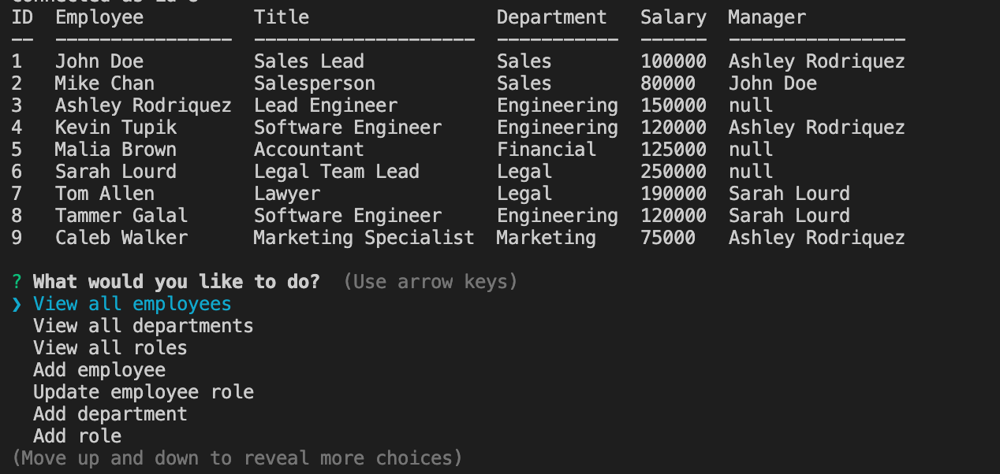

# EmployeeTracker

## Description
This app will track the a company's employees, departments, and job titles in a SQL database and allow the user to make basic changes.

## Installation

To install, clone the directory to your local machine and run 'npm i' from the command line to install the node package dependencies. A database will also need to be setup on your local machine, which you can do by using the provided employee_db.sql file. If installed correctly, you can then run 'node app.js'. 

## Questions

You can find my Github user profile [here.](https://github.com/calebkw91)
I can be reached by email at walke1291@gmail.com